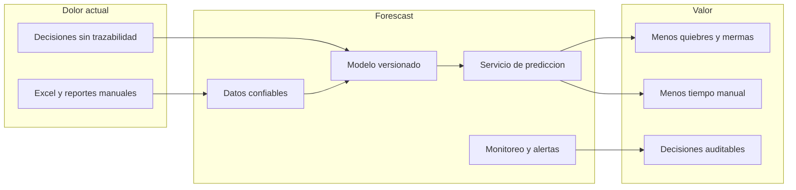

# Forescast — Pitch de negocio

**Sistema inteligente de pronóstico de ventas para retail**

Proyecto de la **Maestría en Inteligencia Artificial y Ciencia de Datos · Universidad
Autónoma de Occidente (UAO)** · Cali, Colombia.

> Documento técnico e instalación: [README.md](README.md) · Guion Demo Day técnico:
> [docs/DEMO_DAY.md](docs/DEMO_DAY.md) · Guion Demo Day comercial:
> [docs/DEMO_DAY_COMERCIAL.md](docs/DEMO_DAY_COMERCIAL.md) · Marco de negocio:
> [docs/BMC_Pronostico_Ventas.pdf](docs/BMC_Pronostico_Ventas.pdf) · KPIs de innovación:
> [docs/DIB_Pronostico_Ventas.pdf](docs/DIB_Pronostico_Ventas.pdf)

---

## Elevator pitch

**Forescast** convierte el histórico masivo de ventas de una cadena de supermercados en
Cali en **pronósticos accionables y auditables**, mediante un pipeline MLOps de punta a
punta: datos, modelado de series de tiempo, registro de modelos, API de predicción y
monitoreo operativo.

No vendemos un notebook aislado: entregamos una **fábrica de pronósticos** que la
organización puede operar, integrar y mejorar con el tiempo.

**Tagline:** *De la intuición en Excel a decisiones de compra trazables en minutos.*

---

## El problema

La cadena con la que trabajamos planifica compras e inventario con **hojas de cálculo**,
**reportes fragmentados** desde un ERP en transición y decisiones basadas en **intuición**.
Eso genera cuatro dolores medibles en operación:

| Dolor | Impacto en el negocio |
|-------|------------------------|
| **Quiebres frecuentes** en productos de alta rotación | Venta perdida y clientes insatisfechos |
| **Mermas y vencimientos** en perecederos por sobrestock | Capital inmovilizado y desperdicio |
| **Retraso** entre el cierre del día y la información disponible | Compras reactivas en lugar de proactivas |
| **Falta de trazabilidad** en decisiones de compra | Imposible auditar, mejorar o escalar el criterio |

El problema está documentado en el [Business Model Canvas](docs/BMC_Pronostico_Ventas.pdf)
y en el [Data Innovation Board](docs/DIB_Pronostico_Ventas.pdf) del proyecto. La
oportunidad no es solo “predecir mejor”, sino **industrializar** cómo el retail pasa de
datos crudos a decisiones repetibles.

---

## Nuestra solución

Forescast es un **pipeline MLOps end-to-end**, simple y demostrable, que cubre seis
capacidades de negocio:

1. **Ingesta y calidad de datos a escala** — Limpieza y consolidación desde histórico
   CSV (~17 GB crudo, decenas de millones de transacciones); lectura en chunks con pico
   de RAM ~50 MB, viable en equipos de 8–32 GB.
2. **Señales listas para modelado** — Agregación diaria, formato estándar Nixtla
   (`unique_id`, `ds`, `y`), variables de calendario y detección de outliers (IQR +
   Z-score).
3. **Selección sistemática del mejor modelo** — Comparación de **7 baselines**
   (StatsForecast / Nixtla) con backtest temporal; el ganador se persiste como
   `sales-forecaster`.
4. **Gobierno del modelo** — MLflow para experimentos, métricas, artefactos, Model
   Registry (`sales-forecaster`) y **traces** (`@mlflow.trace`) en cada etapa crítica.
5. **Servicio de predicción** — API REST (FastAPI) con `/predict`, `/health`,
   `/model-info` y métricas Prometheus; app Streamlit para validar histórico vs pronóstico
   con equipos de compras y gerencia.
6. **Observabilidad operativa** — Prometheus + Grafana (alertas de latencia p95, tasa de
   error, disponibilidad del modelo y del target API).

**Series que pronostica hoy:** `valor_neto` y `valor_costo` a nivel **agregado diario
global**. La visión del BMC apunta a granularidad SKU–tienda–día; el pipeline actual es la
base escalable hacia ese destino.

---

## Por qué nuestro modelo y arquitectura

El diferenciador no es un único algoritmo: es **cómo** el retail puede adoptar, medir y
evolucionar el pronóstico sin depender de un científico de datos en cada iteración.

| Ventaja técnica | Por qué importa al negocio |
|-----------------|----------------------------|
| **MLOps end-to-end** (datos → modelo → API → monitoreo) | Reproducibilidad, auditoría y handoff claro a IT; no es una “caja negra” en un notebook |
| **Nixtla (StatsForecast)** | Comparación rigurosa de modelos de series de tiempo; camino natural a NeuralForecast (NHITS, NBEATS) |
| **MLflow tracking + registry + traces** | Historial de qué modelo se eligió y por qué; depuración de cuellos de botella (p. ej. entrenamiento) |
| **Procesamiento chunked** (~50 MB RAM pico) | Históricos reales de retail sin infraestructura costosa al inicio |
| **FastAPI + contrato `/predict`** | Integración con ERP, BI o aplicaciones internas |
| **Docker Compose** | Piloto o demo en horas; mismo código preparado para cloud (Azure ML, SageMaker, Vertex AI) |
| **Prometheus / Grafana** | SLA de inferencia, alertas; base para drift y reentrenamiento automático |
| **22 tests pytest** (21 passed, 1 skipped) | Menor riesgo de regresión al cambiar modelos o datos |

**Mensaje estratégico:** el activo principal es la **fábrica de pronósticos**. El modelo
actual (AutoARIMA) es el mejor baseline hoy; la precisión mejora al añadir variables
exógenas, mayor granularidad y modelos más avanzados — sin reescribir la plataforma.

---

## Valor económico y KPIs

### North star (Data Innovation Board)

| Métrica | Meta definida en el DIB |
|---------|-------------------------|
| MAPE | ≤ 10 % |
| R² | ≥ 0.80 |
| RMSE / MAE | Mejor que baseline ingenuo |
| Tiempo de generación de dato | Reducción significativa vs proceso manual |

### Estado actual del modelo (honesto)

Entrenamiento con backtest de **3 ventanas**, horizonte **30 días**, agregado diario sobre
~1 año de histórico. Fuente: [`reports/metrics/train_metrics.json`](reports/metrics/train_metrics.json).

| Modelo | MAPE promedio |
|--------|---------------:|
| **AutoARIMA(7)** (mejor) | **20,96 %** |
| HistoricAverage | 21,88 % |
| MSTL([7, 30]) | 22,13 % |
| SeasonalNaive(7) | 31,11 % |
| Naive | 40,55 % |
| AutoTheta(7) | 42,22 % |
| AutoETS(7) | 60,36 % |

**Lectura:** AutoARIMA supera a todos los baselines evaluados, incluidos ingenuos y
estacionales. La brecha frente al KPI del DIB (MAPE ≤ 10 %) es **esperable** en esta
versión: series agregadas globales, sin variables exógenas (festivos Cali, promociones,
clima, IPC) y sin granularidad por categoría o sede. El roadmap del proyecto documenta
cómo cerrarla (ver Anexo).

**Beneficios de piloto** (cualitativos, alineados al BMC):

- Menos horas-hombre en consolidación manual de reportes.
- Menor stockout en alta rotación al anticipar demanda.
- Menor sobrestock en perecederos al alinear compras con pronóstico.
- Trazabilidad para auditoría interna y conversaciones con proveedores.

---

## Por qué invertir o usar Forescast ahora

### Para la cadena de supermercados (adopción)

- **Piloto de bajo riesgo:** stack open-source; despliegue local o con `docker compose up`;
  los datos pueden permanecer en el perímetro del cliente.
- **Validación con negocio:** Streamlit muestra histórico vs pronóstico y KPIs sin
  exigir integración API desde el día uno; la app hace fallback local si la API no está
  activa.
- **Camino a producción:** API lista para ERP/BI; registry MLflow (`sales-forecaster`);
  observabilidad ya cableada (latencia, errores, modelo cargado).
- **Escalabilidad de alcance:** el mismo pipeline admite más series, sedes y categorías
  conforme crezca la calidad de datos — visión explícita en el BMC.

### Para inversores y aliados académico-industriales

- **Caso real en Cali** con equipo multidisciplinar UAO (datos, MLOps, diseño de negocio).
- **Producto demostrable:** pipeline de datos, featuring, entrenamiento, registry,
  inferencia, API, Streamlit, Prometheus y Grafana operativos; guion de 10 minutos en
  [docs/DEMO_DAY.md](docs/DEMO_DAY.md).
- **Hitos:** Demo Day **30 de mayo de 2026** · entrega final **3 de junio de 2026**.
- **Mercado:** retail en LATAM con madurez analítica heterogénea; alto retorno en ser el
  primer despliegue MLOps que **funciona y se puede auditar**, no solo un POC de modelo.
- **Repositorio abierto:** [github.com/jennramos87/Forescast_Project](https://github.com/jennramos87/Forescast_Project).

---

## Modelo de colaboración sugerido

Sin comprometer cifras comerciales no definidas en el proyecto; el BMC detalla socios e
ingresos. Propuesta de fases:

| Fase | Objetivo | Entregables típicos |
|------|----------|---------------------|
| **1 — Piloto** | Validar valor con datos históricos del cliente | KPIs acordados (MAPE, tiempo de reporte), demo Streamlit, informe vs proceso manual |
| **2 — Producción** | Integrar en operación diaria | API en registry MLflow, alerting real (Slack/email), CI/CD, runbooks |
| **3 — Escala** | Cobertura multi-sede / SKU y mejora continua | Cloud gestionado, monitoreo de drift, reentrenamiento automático, variables exógenas |

**Datos necesarios para arrancar:** histórico de ventas equivalente a
`data_consolidada.csv` (formato acordado con el equipo; no se publica en el repo por
tamaño y confidencialidad).

---

## Equipo

| Integrante | Rol |
|------------|-----|
| **Frank Edward Daza Gonzalez** | Scaffolding inicial, dependencias |
| **Jenn Ramos** ([@jennramos87](https://github.com/jennramos87)) | Datos, EDA, featuring, outliers |
| **Yancarlos Cuarán** | EDA, integración del equipo |
| **Juan M. Velásquez T.** | Diseño del problema (BMC / DIB), arquitectura MLOps |

Maestría en Inteligencia Artificial y Ciencia de Datos · **UAO** · Cali, Colombia.

---

## Llamada a la acción

**¿Quiere usar Forescast en su operación?**  
Inicie un piloto con histórico de ventas y KPIs alineados al DIB; evalúe pronósticos en
Streamlit y, cuando esté listo, integre la API con compras o el ERP.

**¿Quiere invertir o patrocinar la escalada?**  
Apoye variables exógenas, granularidad SKU–tienda, despliegue cloud y equipo MLOps para
cerrar la brecha de precisión y llevar el sistema a producción regional.

**Recursos:**

- Técnico: [README.md](README.md)
- Demo en vivo: [docs/DEMO_DAY.md](docs/DEMO_DAY.md)
- Negocio: [docs/BMC_Pronostico_Ventas.pdf](docs/BMC_Pronostico_Ventas.pdf)
- Innovación de datos: [docs/DIB_Pronostico_Ventas.pdf](docs/DIB_Pronostico_Ventas.pdf)

---

## Anexo — Transparencia y hoja de ruta

### Limitaciones actuales

- Solo se modelan series agregadas (`valor_neto`, `valor_costo`); granularidad
  SKU–tienda–día queda fuera del alcance del Demo Day.
- No hay variables exógenas (clima, promociones, IPC) en esta versión.
- MAPE ~21 % vs meta del DIB ≤ 10 % — documentado y con plan de cierre.
- Alertas de Grafana en demo usan webhook noop (sin notificaciones reales aún).

### Próximos pasos (post-pitch)

1. Cerrar brecha de MAPE: festivos Colombia/Cali, IPC, clima, promociones; granularidad
   por categoría o sede; modelos neurales (NHITS, NBEATS) si el histórico lo permite.
2. Alerting en producción con contact points reales y runbooks.
3. Migrar MLflow a backend SQLite/Postgres (filesystem store deprecado desde feb. 2026).
4. API consumiendo modelo desde Registry (`models:/sales-forecaster@production`) con
   fallback al joblib local.
5. CI/CD: GitHub Actions con `pytest` y `docker compose build` en cada PR.
6. Despliegue cloud (Azure ML, AWS SageMaker o GCP Vertex AI).
7. Monitoreo de drift y reentrenamiento automático cuando degrade el MAPE en producción.

---

*Forescast_Project · UAO · 2026*
