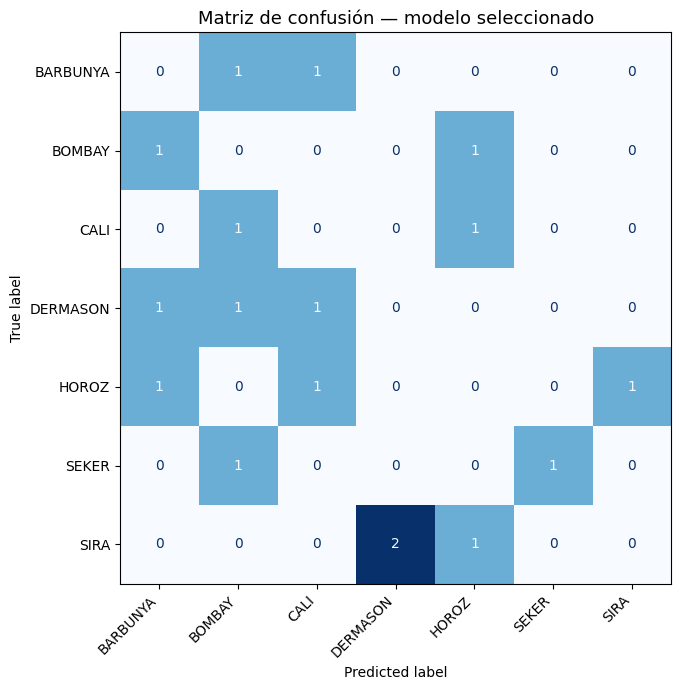

# Informe del Laboratorio — Clasificación Dry Bean (UCI 602)

**Proyecto:** Laboratorio de Inteligencia Artificial — Ciencia de Datos
**Universidad:** Universidad Autónoma de Occidente
**Equipo:** Jenifer Ramos, Juan Velasquez, Yan Cuaran, Frank Daza
**Fecha:** 2026-05-15
**Metodología:** CRISP-DM + TDSP + Scrum ML

---

## 1. Comprensión del negocio

El objetivo de este laboratorio es construir un sistema de clasificación automática de
granos secos (*Dry Bean*) a partir de características geométricas y de forma extraídas
mediante técnicas de visión por computador. El problema surge de la necesidad de
automatizar la inspección de calidad en la industria alimentaria, donde la clasificación
manual es costosa, lenta y propensa a error humano.

Se busca responder: **dado un conjunto de 16 medidas geométricas de un grano, ¿a cuál
de las 7 variedades pertenece?** Las variedades son BARBUNYA, BOMBAY, CALI, DERMASON,
HOROZ, SEKER y SIRA.

El éxito del proyecto se mide con dos métricas complementarias:

- **Accuracy:** proporción global de clasificaciones correctas.
- **F1 macro:** promedio no ponderado del F1 por clase, lo que penaliza fallos en
  clases minoritarias y ofrece una visión equilibrada del rendimiento.

Este laboratorio sigue las fases de **CRISP-DM** adaptadas al contexto académico con
estructura de carpetas **TDSP** y gestión ágil mediante **Scrum ML**.

---

## 2. Comprensión de datos

### Origen y descarga

El dataset proviene del **UCI Machine Learning Repository** (id **602**). Se descarga
programáticamente con el módulo `ucimlrepo` a través de la función
`fetch_drybean()` definida en [`src/data_loading.py`](../../src/data_loading.py),
que además soporta cacheo local en formato Parquet.

### Dimensiones y estructura

| Atributo             | Valor                          |
|----------------------|--------------------------------|
| Instancias totales   | 13 611                         |
| Features numéricas   | 16                             |
| Variable objetivo    | `Class` (categórica, 7 clases) |
| Valores nulos        | 0                              |
| Filas duplicadas     | 68 (eliminadas en preparación) |

### Features del dataset

Las 16 variables describen propiedades geométricas y de forma de cada grano:

| Feature           | Descripción                                      |
|-------------------|--------------------------------------------------|
| Area              | Área del grano (pixeles)                         |
| Perimeter         | Perímetro del grano (pixeles)                    |
| MajorAxisLength   | Longitud del eje mayor de la elipse ajustada     |
| MinorAxisLength   | Longitud del eje menor de la elipse ajustada     |
| AspectRatio       | Relación entre eje mayor y menor                 |
| Eccentricity      | Excentricidad de la elipse ajustada              |
| ConvexArea        | Área del envolvente convexo (pixeles)            |
| EquivDiameter     | Diámetro del círculo con igual área              |
| Extent            | Proporción de pixeles en el bounding box         |
| Solidity          | Relación entre área real y envolvente convexo    |
| Roundness         | Circularidad del grano                           |
| Compactness       | Compacidad de la forma                           |
| ShapeFactor1      | Factor de forma 1                                |
| ShapeFactor2      | Factor de forma 2                                |
| ShapeFactor3      | Factor de forma 3                                |
| ShapeFactor4      | Factor de forma 4                                |

### Distribución de clases

| Clase     | Cantidad | Proporción |
|-----------|----------|------------|
| DERMASON  | 3 546    | 26.1 %     |
| SIRA      | 2 636    | 19.4 %     |
| SEKER     | 2 027    | 14.9 %     |
| HOROZ     | 1 928    | 14.2 %     |
| CALI      | 1 630    | 12.0 %     |
| BARBUNYA  | 1 322    | 9.7 %      |
| BOMBAY    | 522      | 3.8 %      |

El dataset presenta un desbalance moderado: DERMASON es la clase más representada
(26.1 %) mientras que BOMBAY es la menos frecuente (3.8 %). Este desbalance justifica
el uso de F1 macro como métrica complementaria al accuracy.

### Calidad de datos

- **Nulos:** 0 en todas las columnas.
- **Duplicados:** se encontraron 68 filas duplicadas que fueron eliminadas durante la
  preparación.
- **Tipos de datos:** todas las features son numéricas continuas (`float64`); la
  variable objetivo es categórica (`object`).

El análisis exploratorio completo se encuentra en el notebook
[`notebooks/01_eda_drybean.ipynb`](../../notebooks/01_eda_drybean.ipynb), que incluye
distribuciones por feature, boxplots por clase, y la matriz de correlación.

---

## 3. Preparación de datos

La preparación se implementó en [`src/preprocessing.py`](../../src/preprocessing.py)
con dos funciones puras que no dependen del modelo:

### 3.1. Limpieza (`clean`)

- Eliminación de filas duplicadas con `drop_duplicates()`.
- Eliminación de filas con valores nulos con `dropna()`.
- Validación de que la columna `Class` no contenga nulos después de la limpieza.
- Reinicio de índices con `reset_index(drop=True)`.

**Resultado:** el dataset pasa de 13 611 a 13 543 instancias tras eliminar 68
duplicados.

### 3.2. Partición (`split`)

- Método: `train_test_split` de scikit-learn con **estratificación** por la variable
  `Class`, preservando la distribución proporcional de clases en ambos conjuntos.
- **Proporción:** 80 % entrenamiento / 20 % prueba (`test_size=0.2`).
- **Semilla:** `random_state=42` para reproducibilidad.
- **Conjunto de entrenamiento:** 10 834 instancias.
- **Conjunto de prueba:** 2 709 instancias.

Las transformaciones que dependen del modelo (como `StandardScaler`) se encapsulan
dentro del `Pipeline` de scikit-learn, lo que previene fuga de datos (*data leakage*)
al aplicar el escalado únicamente con los estadísticos del conjunto de entrenamiento.

---

## 4. Modelado

Se entrenaron dos modelos usando `Pipeline` de scikit-learn, siguiendo las consignas
del laboratorio.

### 4.1. Modelo baseline — Regresión logística

**Archivo:** [`src/models/baseline.py`](../../src/models/baseline.py)

```
Pipeline([
    ("scaler", StandardScaler()),
    ("lr", LogisticRegression(max_iter=1000, random_state=42))
])
```

| Hiperparámetro | Valor | Justificación |
|----------------|-------|---------------|
| `max_iter`     | 1 000 | Garantiza convergencia del solver con 16 features |
| `random_state` | 42    | Reproducibilidad entre ejecuciones |

El `StandardScaler` centra y escala cada feature a media 0 y varianza 1, lo cual es
necesario para la regresión logística que optimiza una función basada en distancias.

### 4.2. Modelo alternativo — Random Forest

**Archivo:** [`src/models/random_forest.py`](../../src/models/random_forest.py)

```
Pipeline([
    ("rf", RandomForestClassifier(n_estimators=300, max_depth=None,
                                   random_state=42, n_jobs=-1))
])
```

| Hiperparámetro  | Valor  | Justificación |
|------------------|--------|---------------|
| `n_estimators`   | 300    | Compromiso entre estabilidad del ensamble y tiempo |
| `max_depth`      | None   | Árboles crecen hasta nodos puros; el ensamble controla sobreajuste |
| `random_state`   | 42     | Reproducibilidad |
| `n_jobs`         | -1     | Usa todos los núcleos disponibles |

Random Forest no requiere escalado previo, pero se mantiene el `Pipeline` por
consistencia con el baseline y para facilitar la persistencia con `joblib`.

---

## 5. Evaluación

### 5.1. Comparación de modelos

La evaluación se implementó en [`src/evaluation.py`](../../src/evaluation.py).
Los resultados sobre el conjunto de prueba (2 709 instancias) son:

| Modelo          | Accuracy | F1 macro |
|-----------------|----------|----------|
| **Baseline (LR)**  | **0.9195** | **0.9306** |
| Random Forest   | 0.9192   | 0.9305   |

**Modelo seleccionado: baseline** (Pipeline con StandardScaler + LogisticRegression).

Ambos modelos alcanzan un rendimiento prácticamente idéntico (~92 % accuracy, ~93 %
F1 macro). Se seleccionó el baseline por tener un F1 macro marginalmente superior
(0.93055 vs 0.93054) y por ser un modelo más simple, interpretable y rápido de
entrenar — principio de parsimonia.

La tabla comparativa completa se encuentra en
[`outputs/reports/comparison.csv`](comparison.csv).

### 5.2. Reporte por clase (modelo seleccionado)

| Clase     | Precision | Recall | F1-score | Soporte |
|-----------|-----------|--------|----------|---------|
| BARBUNYA  | 0.93      | 0.89   | 0.91     | 265     |
| BOMBAY    | 1.00      | 1.00   | 1.00     | 104     |
| CALI      | 0.91      | 0.94   | 0.93     | 326     |
| DERMASON  | 0.93      | 0.91   | 0.92     | 709     |
| HOROZ     | 0.96      | 0.94   | 0.95     | 372     |
| SEKER     | 0.93      | 0.94   | 0.94     | 406     |
| SIRA      | 0.86      | 0.89   | 0.87     | 527     |

**Observaciones:**

- **BOMBAY** se clasifica perfectamente (F1 = 1.00), posiblemente debido a que sus
  granos son significativamente más grandes que los del resto de variedades.
- **SIRA** presenta el F1 más bajo (0.87), lo que sugiere mayor solapamiento
  geométrico con otras variedades (especialmente DERMASON y BARBUNYA).
- Ninguna clase cae por debajo de 0.86 en precisión ni recall, indicando un modelo
  robusto a través de todas las variedades.

El reporte completo por clase está en
[`outputs/reports/classification_report.txt`](classification_report.txt).

### 5.3. Matriz de confusión

La matriz de confusión del modelo seleccionado se generó con
`ConfusionMatrixDisplay` de scikit-learn y se almacena en
[`outputs/reports/confusion_matrix.png`](confusion_matrix.png).



Los errores más frecuentes se concentran entre clases geométricamente similares
(SIRA-DERMASON, SIRA-BARBUNYA), lo que es coherente con la literatura sobre el dataset.

---

## 6. Despliegue

### 6.1. Persistencia del modelo

El modelo seleccionado se serializa con `joblib` mediante la función `save_model()`
definida en [`src/inference.py`](../../src/inference.py):

```python
from src.inference import save_model

save_model(pipeline, "outputs/models/baseline_drybean.joblib")
```

**Ruta del modelo:** `outputs/models/*.joblib`
**Formato:** joblib (estándar de scikit-learn para serialización eficiente de
pipelines).

### 6.2. Carga y predicción

Para cargar el modelo y generar predicciones:

```python
from src.inference import load_model, predict, predict_one

# Cargar modelo serializado
modelo = load_model("outputs/models/baseline_drybean.joblib")

# Predecir sobre un DataFrame completo
predicciones = predict(modelo, X_test)

# Predecir un único grano
clase = predict_one(modelo, {
    "Area": 54386, "Perimeter": 887.35, "MajorAxisLength": 332.58,
    "MinorAxisLength": 208.45, "AspectRatio": 1.595, "Eccentricity": 0.778,
    "ConvexArea": 55132, "EquivDiameter": 263.2, "Extent": 0.761,
    "Solidity": 0.987, "Roundness": 0.868, "Compactness": 0.793,
    "ShapeFactor1": 0.00611, "ShapeFactor2": 0.00172,
    "ShapeFactor3": 0.629, "ShapeFactor4": 0.996,
})
print(clase)  # ej. 'SIRA'
```

El módulo `src/inference.py` acepta tanto un `Pipeline` en memoria como una ruta a
un archivo `.joblib`, facilitando la integración en distintos flujos de trabajo.

### 6.3. Reproducibilidad

Para ejecutar el pipeline completo desde cero:

```bash
uv sync                    # Instalar dependencias desde uv.lock
uv run pytest              # Ejecutar suite de pruebas
uv run jupyter lab notebooks/01_laboratorio_drybean.ipynb  # Notebook integrador
```

La fuente de verdad del entorno es `pyproject.toml` + `uv.lock`, gestionados con
**UV** (Python 3.12).

---

## 7. Scrum ML

### 7.1. Backlog

El laboratorio se gestionó con un **Product Backlog** de 6 historias de producto
(PB-01 a PB-06), descompuestas en **19 tareas técnicas** (TASK-1 a TASK-19) siguiendo
Scrum ML. El backlog se administra con Backlog.md en `backlog/tasks/` y la
configuración del proyecto en `backlog/config.yml`.

**Documentación formal del backlog y roles:** [Product Backlog PB-01..PB-06](../../docs/product-backlog.md) y [roles Scrum ML](../../docs/scrum/roles.md).

**Roles del equipo:**

| Rol               | Integrante      |
|--------------------|-----------------|
| Product Owner      | Frank Daza      |
| Scrum Master       | Juan Velasquez  |
| Data Engineer / Analyst | Yan Cuaran   |
| ML Engineer        | Jenifer Ramos   |

### 7.2. Avance por sprint

**Sprint 1 — Bases y exploración:**

- TASK-1: Analizar consignas y alineación TDSP (Frank Daza) — Done
- TASK-2: Validar y congelar estructura TDSP (Frank Daza) — Done
- TASK-3: Estructura física de carpetas TDSP (Frank Daza) — Done
- TASK-4: Definir Product Backlog y roles Scrum (Frank Daza) — Done
- TASK-5: Configurar entorno UV + Python 3.12 (Juan Velasquez) — Done
- TASK-6: Documentar política de datos (Yan Cuaran) — Done
- TASK-7: Estándares de calidad de código (Frank Daza) — To Do
- TASK-8: Módulo data_loading.py (Juan Velasquez) — Done
- TASK-9: Notebook EDA (Yan Cuaran) — Done

**Sprint 2 — Modelado y evaluación:**

- TASK-10: Preprocesamiento (Juan Velasquez) — Done
- TASK-11: Modelo baseline LogisticRegression (Juan Velasquez) — Done
- TASK-12: Modelo alternativo RandomForest (Jenifer Ramos) — Done
- TASK-13: Evaluación comparativa (Jenifer Ramos) — Done
- TASK-14: Persistencia e inferencia (Jenifer Ramos) — Done

**Sprint 3 — Integración y entrega:**

- TASK-15: Notebook integrador CRISP-DM end-to-end (Frank Daza) — Done
- TASK-16: Reporte breve 7 secciones (Juan Velasquez) — Done
- TASK-17: Evidencias Scrum ML (Frank Daza) — To Do
- TASK-18: README final y requirements.txt (Yan Cuaran) — To Do
- TASK-19: CI con GitHub Actions (Frank Daza) — To Do

**Estado actual:** 14 de 19 tareas completadas (74 %).

### 7.3. Retrospectiva

**Qué funcionó:**

- La estructura TDSP desde el inicio facilitó que todo el equipo supiera dónde colocar
  cada artefacto sin conflictos.
- El uso de `Pipeline` de scikit-learn previno fugas de datos y simplificó la
  persistencia.
- UV como gestor de entorno garantizó que todos los integrantes trabajaran con las
  mismas dependencias sin incidentes de compatibilidad.

**Qué no funcionó:**

- La documentación formal de estándares de código (**TASK-7**) se postergó frente al
  trabajo técnico, generando deuda de proceso.
- La coordinación entre ramas feature requirió resolver conflictos de merge que
  podrían haberse evitado con integraciones más frecuentes.

**Qué mejorar:**

- Incluir la documentación Scrum (roles, retrospectiva) como criterio de cierre del
  sprint, no como tarea al final.
- Automatizar la validación del código con CI (TASK-19) desde el Sprint 1 para
  detectar regresiones tempranamente.
- Realizar retrospectivas al final de cada sprint, no solo al cierre del proyecto.

---

## Referencias

- **Dataset:** [Dry Bean Dataset — UCI ML Repository (id 602)](https://archive.ics.uci.edu/dataset/602/dry+bean+dataset)
- **Notebook integrador:** [`notebooks/01_laboratorio_drybean.ipynb`](../../notebooks/01_laboratorio_drybean.ipynb)
- **Notebook EDA:** [`notebooks/01_eda_drybean.ipynb`](../../notebooks/01_eda_drybean.ipynb)
- **Comparación de modelos:** [`outputs/reports/comparison.csv`](comparison.csv)
- **Matriz de confusión:** [`outputs/reports/confusion_matrix.png`](confusion_matrix.png)
- **Reporte por clase:** [`outputs/reports/classification_report.txt`](classification_report.txt)
- **Métricas baseline:** [`outputs/reports/metrics_baseline.json`](metrics_baseline.json)
- **Métricas Random Forest:** [`outputs/reports/metrics_rf.json`](metrics_rf.json)
- **Código fuente:** [`src/`](../../src/)
- **Pruebas unitarias:** [`tests/`](../../tests/)
- **Evidencias Scrum:** [`outputs/reports/scrum/`](scrum/) *(pendiente TASK-17)*
